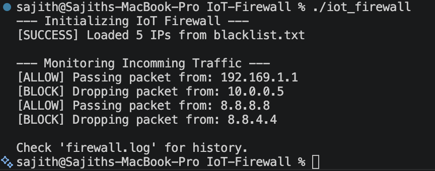
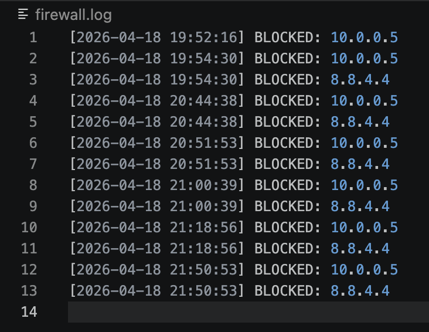

# Probabilistic IoT Firewall

A high concurrency C++ security service that helps resource constrained IoT devices to block malicious traffic using memory efficient Counting Bloom Filters.

### System Preview

<p align="center">
  
  
</p>


### Features

- **Memory Optimization**: Replaces heavy IP string storage with 8-bit counters, reducing RAM usage by ~90% compared to traditional sets.
- **Dynamic Blacklisting**: Supports real-time addition and **deletion** (unblocking) of IPs without corrupting the filter state.
- **Thread-Safe Concurrency**: Multiple reader/single-writer model allows background monitoring during live list updates.
- **O(k) Lookups**: Provides fixed-time performance regardless of the number of blocked IPs (1,000 or 1,000,000 IPs = same speed).
- **Automated CI/CD**: Integrated GitHub Actions for continuous compilation and testing on Linux environments.

### Tech Stack

- **Language**: C++17
- **Hashing**: MurmurHash3 (128-bit)
- **Concurrency**: C++ Standard Threads & `std::shared_mutex`
- **Testing**: Custom Unit Test Suite
- **Build System**: GNU Make
- **Deployment**: GitHub Actions (CI/CD)

### Architecture / Approach

- **Modular Design**: Separated into `include/` (interfaces) and `src/` (logic) for clean integration into existing IoT firmware.
- **Concurrency Model**: Implements `std::shared_lock` for high-speed packet checking and `std::unique_lock` for administrative updates to ensure data integrity.
- **Data Persistence**: Uses `std::fstream` utilities to load blacklists from disk and log security events with high precision `std::chrono` timestamps.
- **Error Handling**: Includes file stream validation and overflow/underflow protection for counters to ensure long term system stability.

### Trade-offs

- **Probabilistic Accuracy**: We trade a tunable ~1% False Positive rate for 90% memory savings critical for IoT devices where RAM is the primary bottleneck.
- **Counting vs. Bit Array**: We used 8-bit counters instead of 1 bit flags. This uses 8x more memory than a standard Bloom Filter but was necessary to support the **remove** (unblock) feature.
- **Non-Cryptographic Hashing**: We chose MurmurHash3 over SHA-256 for performance. While less "secure" against intentional collisions, it is significantly faster for real time packet filtering.


### Getting Started

```bash
# Clone the repository
git clone https://github.com/MeenakshiChandra14k/IoT-Firewall.git

# Enter the project directory
cd IoT-Firewall

# Build the project
make clean && make

# Run the real time simulator
./iot_firewall


```
### Run Test

```bash
# Build and run the accuracy/thread safety tests
make test
```

### License
MIT


